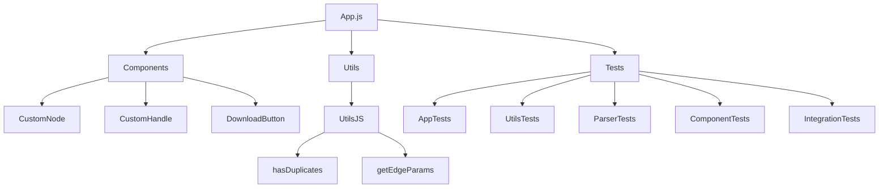

# Beschreibung

Projekt ERiC zur Generierung von ER Diagreammen aus einer textuellen Beschreibung

# Technologie

- Browseranwendung
- React
- React Flow
- Ohm als Domain Specific Language parser
- Speicherung im Browser Store

# Vorgaben

- Saubere Strukturierung
- Clean Code

# Projektstruktur (Stand: Aktuell)

