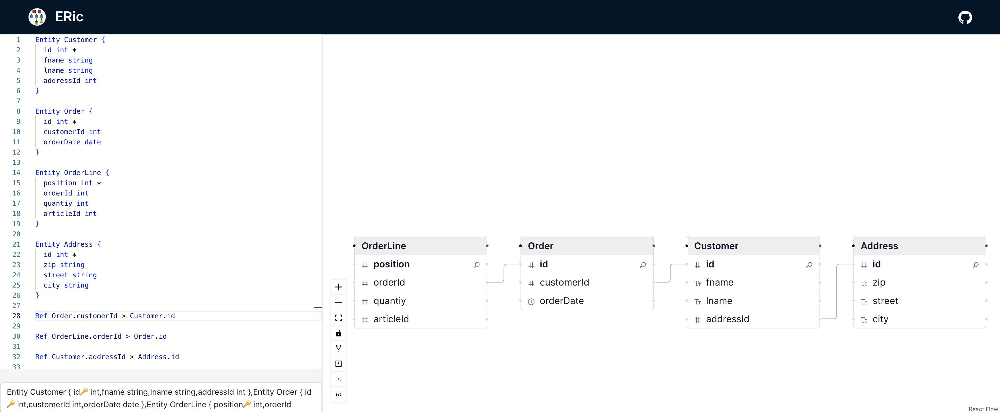

#  ERic	

ERic is an interactive Entity Relationship (ER) creator tool. You can use it to create your ER diagrams using textual descriptions and let ERic visualize the resulting ER diagram.



This diagram was generated using the definiton below:

```
Entity Customer {
  id int [pk]
  fname string
  lname string
}

Entity Order {
  id int [pk]
  customerId int
  orderDate date
}

Entity OrderLine {
  position int [pk]
  quantiy int
  articleId int
}

Entity Address {
  int id [pk]
  zip string
  street string
  city string  
}

Ref Customer > Order

Ref OrderLine > Order

Ref Customer > Address
```