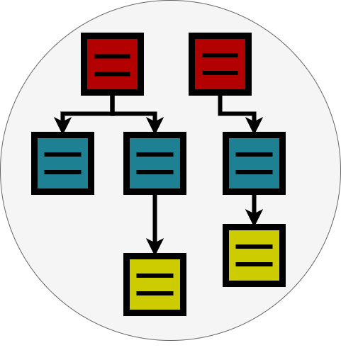

#  ERic	

ERic is an interactive Entity Relationship (ER) creator tool. You can use it to create your ER diagrams using textual descriptions and let ERic visualize the resulting ER diagram.

It is quite similar to [DBML](https://dbml.dbdiagram.io/) but describes Entities more generic (not as technical tables).

You can find a demo environment always running the current stable version at [ERic Demo](https://demoeric.netlify.app/).

---
**NOTE**

This is our first version and constantly under development.

---


This diagram above was generated using the definiton below:

```
Entity Customer {
  id int *
  fname string
  lname string
  addressId int
}

Entity Order {
  id int *
  customerId int
  orderDate date
}

Entity OrderLine {
  position int *
  orderId int
  quantiy int
  articleId int
}

Entity Address {
  id int *
  zip string
  street string
  city string  
}

Ref Order.customerId > Customer.id

Ref OrderLine.orderId > Order.id

Ref Customer.addressId > Address.id
```

You can find a tutorial and the complete description of ERic's grammar in the [user manual here](doc/Userdoc.md).
