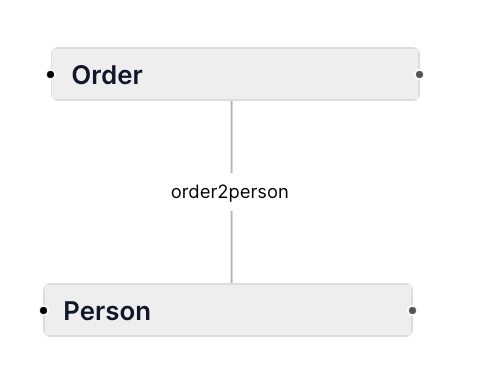

#  ERic	

## Tutorial

ERic UI is divided into two controls, a text editor on the left side and the visualized graph on the right.

Use ERic's domain specific language to create your own entity relationship diagram in the text editor. The resulting graph will be shown on the right:


An entity is marked with the key word Entity followed by a name:

```
Entity Person
```


This is the simplest form of an entity. Entities are displayed as nodes in ERic's graph. You can add an optional alias that can be used to reference the entity:

```
Entity Person as P
```

You can fine tune the definition and add attributes as well:

```
Entity Person {
  id
  fname
  lname
}
```


And finally you can add data types to the attributes and mark primary keys with a "*":

```
Entity Person {
  id int *
  fname string
  lname string
}
```


ERic supports the following data types

- date
- double
- int
- string

With keyword Ref you can model "many to one" relations between two entities either without or with specifying the attributes in charge like

```
Entity A

Entity B

Ref A > B

Entity X {
  id int *
  foreignKey int
}

Entity Y {
  id int *
}

Ref X.foreignKey > Y.id
```

This will create "one to many" connections in ERic's graph based on entities or entity attributes.


Edges can be given names using the "as" clause. These appear in the diagram at the connecting lines.

```
Entity Person

Entity Order

Ref Order > Person as order2person
```



## Quotes

More complex names containing spaces and other special characters can be enclosed in double quotes.

```
Entity "My special entity"

Entity "Very long name with spaces, dots and braces (x.x)" as V
```

For such names, it is recommended to use aliases to reference the entity.

```
Entity "Core.Person" as Per

Entity "Core.Order" as Ord

Ref Ord > Per
```

Alternatively, the following references would be equivalent

    Ref "Core.Order" > Per
    Ref Ord > "Core.Person"
    Ref "Core.Order" > "Core.Person"

Quotes can also bei used to create complex attribute names like:

```
Entity "Core.Person" as Per {
	id int
	"first name" string
	"last name" string
	birth date
}
```

## Grammar

### Names

For names of entities and attributes you can use lower case or uppercase letter followed by letters, numbers oder underscore '_'.

- Entity Person
- Entity order
- Entity order_line
- Entity abc_2_XYZ

Quotes can be used to create entities and attributes with special characters like spaces or dots in their names:

- Entity "Core.Person"
- Entity "My First Entity"

### Refs

You can use the name of an entity or its alias when you create a Ref:

```
Entity Customer as C {
	id int
	address_id int
}

Entity Address as A {
	id int
}

Ref Customer.address_id > Address.id

or

Ref C.address_id > Address.id

or

Ref Customer.address_id > A.id

or

Ref C.address_id > A.id
```

The Ref definition is composed from two entities separated by the greater as symbol '>'. The entity is specified by its name or its alias optionally followed by an attribute separated by a dot:

1. an entity name
1. an attribute name

like in

- Ref OrderLine > Order
- Ref Customer.id > Address.id

### Comments

You can use two kind of comments inside you ER definition. Single line comments are started with two slashes '//'. The remaining characters in a line are ignored by ERic's parsers.

```
// the person
Entity Person {
  id int *     // the person id
  fname string    // the person first name
  lname string    // the person last name
}
```

Multi line comments are opened with '/\*' and closed by '\*/'

```
/*****************
 * the person
*****************/
Entity Person {
  id int *     // the person id
  fname string    // the person first name
  lname string    // the person last name
}
```

---
**NOTE**

The full grammar of ERic's domain specific language can be found in [here](../src/Ohm.js).

---