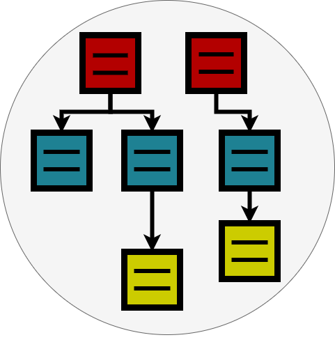
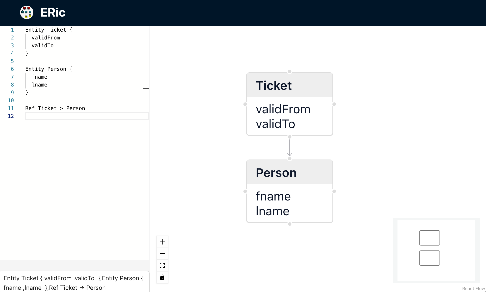
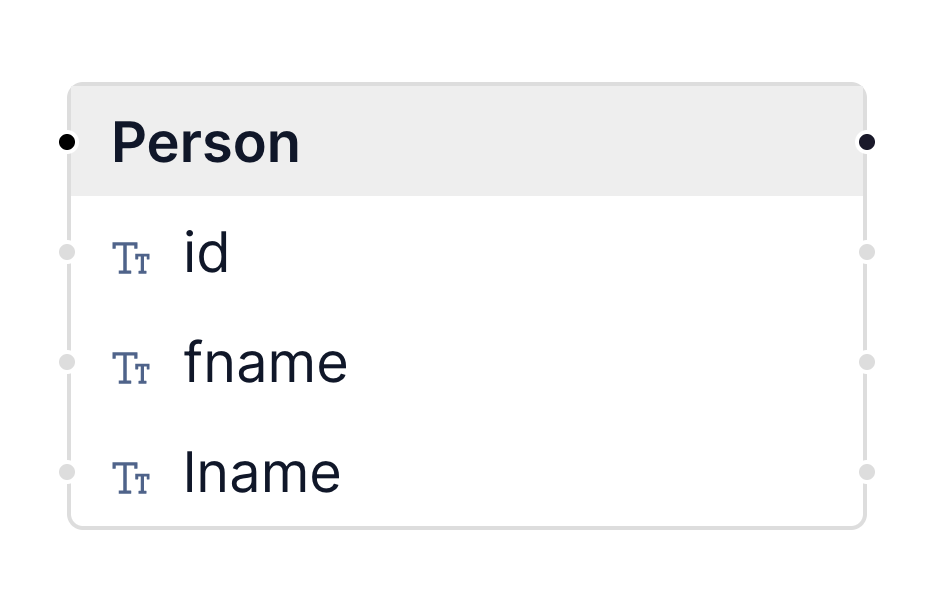
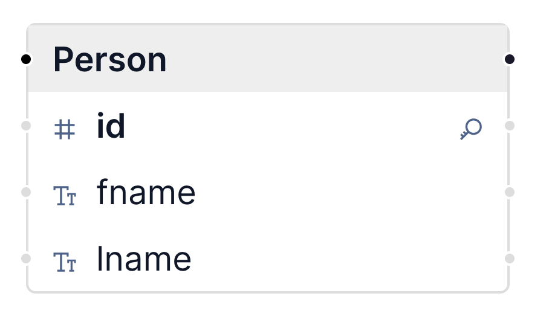
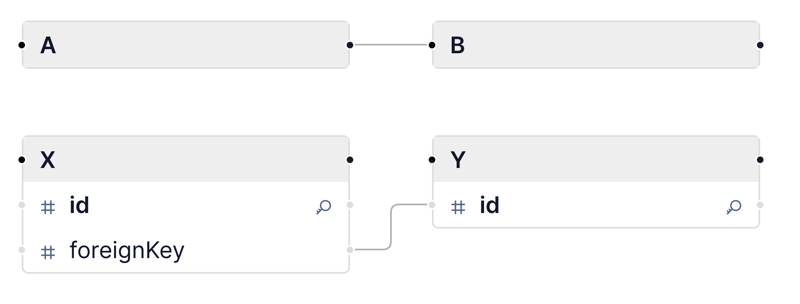

#  ERic	

## Tutorial

ERic UI is divided into two controls, a text editor on the left side and the visualized graph on the right.

Use ERic's domain specific language to create your own entity relationship diagram in the text editor. The resulting graph will be shown on the right:




An entity is marked with the key word Entity followed by a name:

```
Entity Person
```


This is the simplest form of an entity. Entities are displayed as nodes in ERic's graph. You can add an optional alias that can be used to reference the entity:

```
Entity Person as P
```

You can fine tune the definition and add attributes as well:

```
Entity Person {
  id
  fname
  lname
}
```



And finally you can add data types to the attributes and mark primary keys with a "[pk]":

```
Entity Person {
  id int [pk]
  fname string
  lname string
}
```



ERic supports the following data types

- date
- double
- int
- string

With keyword Ref you can model "many to one" relations between two entities like

```
Entity A {
  id int [pk]
  foreignKey int
}

Entity B {
  id int [pk]
}

Ref A.foreignKey > B.id
```

This will create a "one to many" connection in ERic's graph.



## Grammar

### Names

For names of entities and attributes you can use lower case or uppercase letter followed by letters, numbers oder underscore '_'.

- Entity Person
- Entity order
- Entity order_line
- Entity abc_2_XYZ

### Schemas

Entity names can be preceded by a schema name. A schema name is optional and is separated from the entity name using a dot '.' like

```
Entity Order.OrderHeader {
  id int [pk]
  customerId int
  orderDate date
}

Entity Order.OrderLine {
  position int [pk]
  orderId int
  quantiy int
  articleId int
}
```

### Refs

You can use the name of an entity or its alias when you create a Ref:

```
Entity Customer as C {
	id int
	address_id int
}

Entity Address as A {
	id int
}

Ref Customer.address_id > Address.id

or

Ref C.address_id > Address.id

or

Ref C.address_id > A.id
```

The Ref definition is composed from two entities separated by the greater as symbol '>'. The entity is specified by two or three names separated by a dot '.'

1. an optional schema
1. an entity name
1. an attribute name

like in

- Ref Customer.id > Address.id
- Ref Order.OrderLine.orderId > Order.OrderHeader.id

### Comments

You can use two kind of comments inside you ER definition. Single line comments are started with two slashes '//'. The remaining characters in a line are ignored by ERic's parsers.

```
// the person
Entity Person {
  id int [pk]     // the person id
  fname string    // the person first name
  lname string    // the person last name
}
```

Multi line comments are opened with '/\*' and closed by '\*/'

```
/*****************
 * the person
*****************/
Entity Person {
  id int [pk]     // the person id
  fname string    // the person first name
  lname string    // the person last name
}
```

The full grammar of ERic's domain specific language can be found in [here](../src/Ohm.js).
